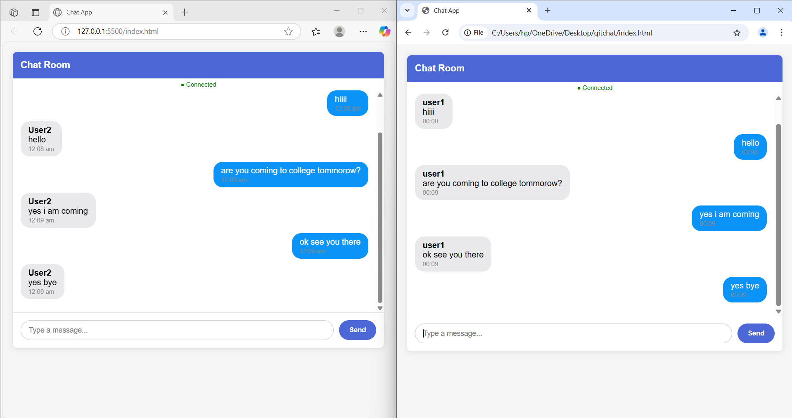

# 💬 Simple Real-Time Chat Application
A basic chat application demonstrating real-time messaging using WebSockets.

# ✨ Features
⚡ Real-time messaging between multiple users

👋 User join/leave notifications

🧼 Simple and clean UI

🔁 Automatic reconnection if connection is lost

🛠️ Technologies Used
🎨 Frontend: HTML, CSS, JavaScript (Vanilla)

🚀 Backend: Node.js with the ws WebSocket library

🌐 Real-time Communication: WebSockets protocol

# 📦 Setup Instructions
- ✅ Prerequisites
Install Node.js (v12 or higher)

# 🖼️ Screenshot

# 🎥 Demo Video

